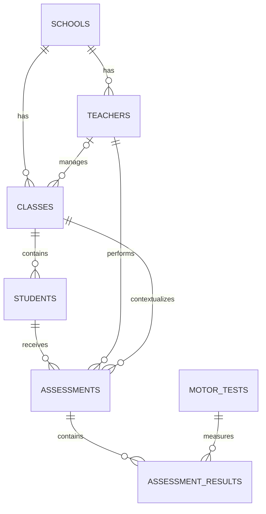

# 🗄️ EduMove - Database Documentation

## Overview

The EduMove database manages schools, teachers, classes, students, motor assessments, motor test definitions, and assessment results.

The database was designed to preserve assessment history, support multiple attempts for each motor test, and allow new tests and protocols to be added without changing the table structure.

Its main design goals are:

* Data integrity
* Historical preservation
* Separation between registration and assessment data
* Flexible motor test registration
* Support for future reports and performance analysis

---

# Database Management System

* **DBMS:** MySQL
* **Language:** SQL
* **ORM:** SQLAlchemy (planned)
* **Naming convention:** English, plural table names, and `snake_case`

---

# Database Structure

## Schools

Stores educational institutions registered in the system.

| Field | Type | Description |
| --- | --- | --- |
| `school_id` | INT | Primary key |
| `name` | VARCHAR(150) | School name |
| `cnpj` | CHAR(14) | Optional unique CNPJ |
| `email` | VARCHAR(100) | School email |
| `phone` | VARCHAR(20) | School phone number |
| `city` | VARCHAR(100) | City |
| `state` | CHAR(2) | Brazilian state code |
| `created_at` | TIMESTAMP | Registration date |
| `updated_at` | TIMESTAMP | Last update date |

---

## Teachers

Stores teachers and their school access profile.

| Field | Type | Description |
| --- | --- | --- |
| `teacher_id` | INT | Primary key |
| `school_id` | INT | Foreign key → `schools.school_id` |
| `name` | VARCHAR(100) | Teacher's full name |
| `email` | VARCHAR(100) | Unique login email |
| `password_hash` | VARCHAR(255) | Password hash |
| `role` | ENUM | `Administrador`, `Professor`, or `Coordenador` |
| `is_active` | BOOLEAN | Active record indicator |
| `created_at` | TIMESTAMP | Registration date |
| `updated_at` | TIMESTAMP | Last update date |

Every teacher must belong to a school. Deactivating a teacher must not remove previously registered assessments.

---

## Classes

Stores school classes and their responsible teacher.

| Field | Type | Description |
| --- | --- | --- |
| `class_id` | INT | Primary key |
| `school_id` | INT | Foreign key → `schools.school_id` |
| `teacher_id` | INT | Optional foreign key → `teachers.teacher_id` |
| `grade_number` | TINYINT | Grade number |
| `education_level` | ENUM | Education level |
| `section` | CHAR(1) | Class section, such as `A` or `B` |
| `academic_year` | YEAR | Academic year |
| `shift` | ENUM | `Manhã`, `Tarde`, `Integral`, or `Noite` |
| `is_active` | BOOLEAN | Active class indicator |
| `created_at` | TIMESTAMP | Registration date |
| `updated_at` | TIMESTAMP | Last update date |

A class is unique by school, grade number, section, and academic year. A class may temporarily exist without a responsible teacher.

---

## Students

Stores student identification and current class information.

| Field | Type | Description |
| --- | --- | --- |
| `student_id` | INT | Primary key |
| `class_id` | INT | Foreign key → `classes.class_id` |
| `registration_number` | VARCHAR(20) | Optional unique registration number |
| `name` | VARCHAR(100) | Student's full name |
| `birth_date` | DATE | Date of birth |
| `sex` | ENUM | `Masculino` or `Feminino` |
| `is_active` | BOOLEAN | Active student indicator |
| `created_at` | TIMESTAMP | Registration date |
| `updated_at` | TIMESTAMP | Last update date |

The student table stores only registration information. Measurements and motor results are stored in assessment-related tables to preserve historical data.

---

## Assessments

Stores each assessment event performed with a student.

| Field | Type | Description |
| --- | --- | --- |
| `assessment_id` | INT | Primary key |
| `student_id` | INT | Foreign key → `students.student_id` |
| `teacher_id` | INT | Foreign key → `teachers.teacher_id` |
| `class_id` | INT | Foreign key → `classes.class_id` |
| `assessment_date` | DATE | Assessment date |
| `weight_kg` | DECIMAL(5,2) | Optional weight in kilograms |
| `height_cm` | DECIMAL(5,2) | Optional height in centimeters |
| `notes` | TEXT | Teacher observations |
| `is_active` | BOOLEAN | Active assessment indicator |
| `created_at` | TIMESTAMP | Registration date |
| `updated_at` | TIMESTAMP | Last update date |

The `teacher_id` and `class_id` fields preserve who performed the assessment and the student's class at that time. Therefore, historical context remains available even if the student later changes classes.

Weight and height are optional because an assessment may contain only motor tests.

---

## Motor Tests

Stores the catalog of motor tests available in EduMove.

| Field | Type | Description |
| --- | --- | --- |
| `motor_test_id` | INT | Primary key |
| `code` | VARCHAR(50) | Unique internal test code |
| `name` | VARCHAR(150) | Test name |
| `unit` | VARCHAR(30) | Measurement unit, such as `cm`, `s`, or `acertos` |
| `result_direction` | ENUM | `higher`, `lower`, or `neutral` |
| `protocol_name` | VARCHAR(100) | Optional protocol name |
| `protocol_description` | TEXT | Optional application instructions |
| `is_active` | BOOLEAN | Active test indicator |
| `created_at` | TIMESTAMP | Registration date |
| `updated_at` | TIMESTAMP | Last update date |

The `result_direction` field defines how a result is interpreted:

* `higher`: a higher value represents better performance;
* `lower`: a lower value represents better performance;
* `neutral`: the value has no direct performance direction.

Motor tests are registered as rows instead of fixed columns. This allows new tests and protocols to be added without altering the database structure.

---

## Assessment Results

Stores individual attempts and results for each motor test performed during an assessment.

| Field | Type | Description |
| --- | --- | --- |
| `assessment_result_id` | INT | Primary key |
| `assessment_id` | INT | Foreign key → `assessments.assessment_id` |
| `motor_test_id` | INT | Foreign key → `motor_tests.motor_test_id` |
| `attempt_number` | TINYINT UNSIGNED | Attempt number, starting at 1 |
| `result_value` | DECIMAL(10,2) | Numeric result |
| `notes` | VARCHAR(255) | Optional result observations |
| `is_active` | BOOLEAN | Active result indicator |
| `created_at` | TIMESTAMP | Registration date |
| `updated_at` | TIMESTAMP | Last update date |

The combination of assessment, motor test, and attempt number must be unique. This prevents the same attempt from being registered twice while allowing multiple attempts for the same test.

---

# Entity Relationship Diagram



The `assessment_results` table creates a flexible many-to-many relationship between assessments and motor tests. Multiple rows may exist for the same assessment and test when the protocol allows more than one attempt.

---

# Data Integrity Rules

The current schema includes the following protections:

* Unique teacher email
* Unique optional school CNPJ
* Unique motor test code
* Unique class by school, grade, section, and academic year
* Unique assessment result by assessment, motor test, and attempt number
* Foreign keys between all dependent entities
* Positive values for weight, height, result value, and attempt number
* Record deactivation through `is_active` instead of permanent deletion
* Automatic `created_at` and `updated_at` timestamps

The service layer must also validate that teachers, classes, students, and assessments belong to the same school. A database-level composite constraint may be added in a future migration.

---

# Initial Motor Tests

The initial seed registers the following motor tests:

| Code | Test | Unit | Direction |
| --- | --- | --- | --- |
| `HORIZONTAL_JUMP` | Salto horizontal | cm | higher |
| `SINGLE_LEG_BALANCE` | Equilíbrio unipodal | s | higher |
| `BALL_RECEPTION` | Recepção de bola | acertos | higher |
| `THROWING_ACCURACY` | Precisão de arremesso | acertos | higher |
| `AGILITY` | Agilidade | s | lower |

Protocol names and descriptions will be added after the scientific references used by the project are selected.

---

# Migration Status

| Migration | Description | Status |
| --- | --- | --- |
| `001_create_schools.sql` | Creates schools | Completed |
| `002_create_teachers.sql` | Creates teachers | Completed |
| `003_create_classes.sql` | Creates classes | Completed |
| `004_create_students.sql` | Creates students | Completed |
| `005_create_assessments.sql` | Creates assessments | Completed |
| `006_create_motor_tests.sql` | Creates the motor test catalog | Completed |
| `007_create_assessment_results.sql` | Creates attempts and results | Completed |

The migration files are the current source of truth for table creation. The main `schema.sql` file still initializes the database and must be consolidated in a later step.

---

# Database Testing

The initial integration test validates the complete flow:

```text
School → Teacher → Class → Student → Assessment → Assessment Result
```

The test uses a transaction and `ROLLBACK`, allowing relationships and queries to be validated without keeping fictitious data in the database.

---

# Next Steps

The next database tasks are:

* Consolidate the migrations into `schema.sql` or implement a migration runner;
* Add negative tests for foreign keys, duplicate values, and validation constraints;
* Create SQLAlchemy models;
* Configure the application connection to MySQL;
* Add protocol references and descriptions to the motor test seed;
* Evaluate a class enrollment history table for future versions.